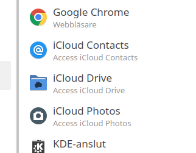
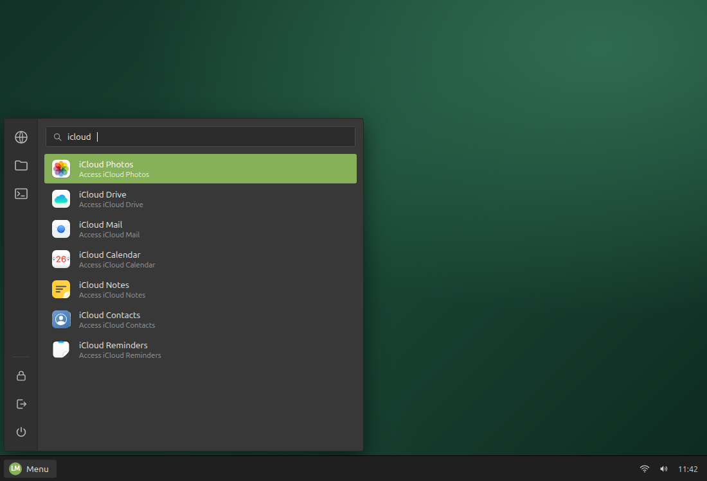

# iCloud for Linux

[](#requirements) [](#signing-in) [](#signing-in) [](#security-design-for-the-technically-inclined) [](CHANGELOG.md) [](LICENSE)

This is a personal project I built first and foremost for my own use — I
wanted my iCloud services on my Linux desktop. I've published it in case
someone else has the same need and can use it as a head start. I work on it in
my spare time, so issues and PRs are welcome but replies may be slow. Use at
your own risk.

> ### 🆕 New in version 2
> The app was rebuilt from the ground up — from an Electron shell to a real,
> bundled browser — and the difference is one feature: **"Sign in with iPhone"
> now actually works.** Version 2.1 adds a browser that verifies its own
> downloads and keeps itself updated. Details in the
> [changelog](CHANGELOG.md).

Your iCloud services — Photos, Drive, Contacts, Mail and the rest — each in its
own application window, launched from your desktop menu. Scan the QR code on
Apple's login page with your iPhone camera, approve with Face ID or Touch ID,
and you're in — no password typing. Passkeys and every other browser feature
work too, because this runs a complete browser.



## What it is

A launcher that opens iCloud in a dedicated Chromium window — no tabs, no
address bar, one window per service, and your session kept between launches.

It ships its own browser rather than using whatever happens to be installed,
so it behaves the same on every machine and nothing breaks when you change
your default browser. By default that browser is Google Chrome's stable
release, fetched from Google's signed repository and **kept up to date
automatically** — a pure open-source Chromium option exists too, see
[Choosing the browser source](#choosing-the-browser-source).

### What it doesn't do

- No file sync, and no integration with your file manager
- It doesn't sync your iCloud files to your disk
- It is a dedicated browser for iCloud, not a native client

## Requirements

- A Linux desktop (tested on Ubuntu 24.04 / Kubuntu 24.04), x86_64
- `curl` and `gpgv`, to fetch and verify the browser — both preinstalled on
  most distributions (`unzip` too, if you pick one of the zip-based browser
  sources)
- About 500 MB of disk space
- Bluetooth, **only** if you want "Sign in with iPhone" — the phone proves it
  is nearby over Bluetooth Low Energy
- Optional: Node.js, only to show the changelog window after an update

You do **not** need Chrome, Chromium, Electron, or Node installed to run it.

## Installation

```bash
git clone https://github.com/cgillinger/icloud-electron.git ~/icloud-electron
cd ~/icloud-electron
./tools/get-chromium.sh          # downloads the browser, about 140 MB, once
./icloud-app.sh photos Photos    # try it
```

Then make it available system-wide and add menu shortcuts:

```bash
sudo ln -sf ~/icloud-electron/icloud-app.sh /usr/local/bin/icloud-app
./install-icons.sh               # optional: Apple-style icons (bundled, no download)
```

Then create the menu shortcuts:

```bash
./tools/install-shortcuts.sh                    # Photos, Drive, Contacts, Calendar
./tools/install-shortcuts.sh photos mail notes  # or pick your own
./tools/install-shortcuts.sh --all              # every service
./tools/install-shortcuts.sh --remove           # remove them again
```

Available services: `photos`, `iclouddrive`, `contacts`, `notes`, `mail`,
`calendar`, `reminders`, `pages`, `numbers`, `keynote`, `find`.

The generated entries set `StartupWMClass` to the window identity Chromium
actually reports, which is what gives each service its own icon in the dock
instead of one shared browser icon.

The icons installed by `install-icons.sh` ship with the repository and come
from the [WhiteSur icon theme](https://github.com/vinceliuice/WhiteSur-icon-theme)
(GPL-3.0) — macOS-style equivalents for each service. See `icons/README.md`
for the exact origin of every file.



*The shortcuts in a Cinnamon menu with the bundled icons.*

## Signing in

Open any service and you get Apple's normal login page, with two options:

**With your iPhone.** Click "Sign in with iPhone", point your iPhone's Camera
app at the QR code, and approve with Face ID or Touch ID. Your phone connects
over Bluetooth to prove it is next to the computer. Nothing is typed and no
password is involved.

**With your password.** Enter your Apple ID and password, then the six-digit
code that appears on one of your Apple devices. Tick "Keep me signed in" to
stay logged in.

Either way, one sign-in covers every iCloud service — they share one profile.

## Why it bundles a browser

Electron — the obvious way to build this, and what this project used until
version 2.0 — packages Chromium's *rendering engine* but not its *browser
layer*. WebAuthn is split straight across that line: the `navigator.credentials`
API lives in the engine, but everything that makes it work in practice
(choosing a transport, drawing the QR code, the credential picker, the PRF and
largeBlob extensions) lives in the browser layer.

The result is that "Sign in with iPhone" in an Electron app spins forever and
never resolves. That is
[electron/electron#24573](https://github.com/electron/electron/issues/24573),
open since 2020 with no solution on Linux.

Running a real browser sidesteps the whole problem: there is nothing to
reimplement, because the browser already does it. The repository never ships a
browser binary — the install script downloads one onto your machine, the same
way `npm install` used to download Electron.

## Choosing the browser source

`tools/get-chromium.sh` installs one of three browsers, chosen with
`ICLOUD_APP_BROWSER_SOURCE`. The choice is sticky: updates keep following the
source you installed from.

| Source | What it is | Verified how | Safe Browsing |
|---|---|---|---|
| `chrome` *(default)* | Google Chrome, stable channel, from Google's apt repository | GPG signature chain, key pinned in this repo | yes |
| `cft` | Chrome for Testing, stable channel | size + MD5 from storage metadata (integrity only) | yes |
| `chromium-snapshot` | Pure open-source Chromium, trunk snapshot | nothing published to verify against | no |

The default is Chrome because it is the only source that is
signature-verified, and because Safe Browsing matters more than usual in a
window with no address bar (see the security section).

**If you want no proprietary code on your machine**, the pure-Chromium option
is a supported, first-class choice — not a leftover:

```bash
ICLOUD_APP_BROWSER_SOURCE=chromium-snapshot ./tools/get-chromium.sh --force
```

Its honest trade-offs: snapshots are trunk builds rather than stable releases,
they lack the `is_official_build` exploit mitigations (CFI, PGO), they carry
no Google API keys so Safe Browsing is inactive, and the archive publishes no
signatures, so the download cannot be verified. You get a fully open-source
browser; you give up those protections knowingly.

## "Is it safe to log in to my Apple account here?"

A fair question to ask before typing an Apple ID password into something a
stranger wrote. Here is the plain answer.

**This app is a shortcut, not a program that logs you in.**

When you click "iCloud Photos" in your menu, a small script runs. It opens a
browser window pointed at `icloud.com` and then hands over to it completely —
the script becomes the browser process. From that moment you are simply using
a browser, the same as if you had opened Chrome and typed `icloud.com`
yourself. The only difference is cosmetic: the
window has no tabs and no address bar, so it feels like an app.

That means:

- **Nothing of this project sits between you and Apple.** Your password goes
  from the browser to Apple, exactly as it would in any browser. There is no
  code here that can read it — once the window is open, the only thing running
  is the browser itself.
- **You are logging in to Apple's real website.** Not a copy, not a form this
  project made. It is `https://www.icloud.com`, served by Apple, over an
  encrypted connection the browser verifies.
- **The browser is a normal one.** By default it is Google Chrome, the same
  browser hundreds of millions of people use — or, if you prefer, the
  open-source Chromium it is built from. This project doesn't modify it — it
  downloads it, verifies it, and starts it.
- **This project has no server and collects nothing.** It has no account, no
  statistics and no error reporting of its own. The browser it starts is an
  ordinary browser, so it does contact Google for its own housekeeping, the
  same as any Chromium would.

**Why it has its own copy of the browser.** So it behaves the same on every
machine, and so your iCloud login is kept in its own compartment rather than
mixed into your everyday browsing.

**What the app can see.** As much as a browser shortcut can see, which is
nothing. What Apple can see is what Apple always sees when you use iCloud on
the web.

**What is worth a moment's thought.** Once you are logged in, the browser
stores a session cookie so you don't have to sign in every time. Anyone with
access to your user account on this computer could potentially copy that cookie
and use your session. That is true of every browser on Linux, not something
this app makes worse — but if you share the machine, sign out when you're done
or don't tick "Keep me signed in".

If you want the technical detail behind all of this, it is in the next section.

## How your credentials and data are handled

This app opens your Apple ID login. Here is exactly what happens to it.

### Your password

**The app never sees, stores, or transmits your password.**

There is no application code between you and Apple. The launcher is a shell
script: it `exec`s a browser pointed at `https://www.icloud.com/<service>`,
replacing itself with the browser process. Everything after that is Chromium
talking to Apple over HTTPS, exactly as any browser would. Nothing is injected
into Apple's pages, and there is no extension, no proxy, and no
instrumentation.

You can read the entire launcher in a couple of minutes — about 190 lines of
shell, most of it argument checking and window placement.

### What is stored on your disk

| What | Where |
|------|-------|
| Browser | `~/.local/share/icloud-app/chromium/` |
| Session cookies, cache, local storage | `~/.config/icloud-app/profile/` |
| Last version whose changelog you saw | `~/.config/icloud-app/profile/app-state.json` |

The profile is separate from your everyday browser, so iCloud cookies never mix
with your normal browsing, in either direction.

**Worth knowing:** the session cookies in that profile are what keep you signed
in. Chromium encrypts them with your desktop keyring when one is available, and
falls back to weak, effectively unencrypted storage when it is not. Anything
running as your user account can potentially read them and reuse your session.
That is true of every Chromium profile on Linux, not something this app makes
worse. To wipe everything, delete the profile directory.

The launcher never sees your password. The browser's own password manager
could store it if you asked it to, so the app switches that off when it first
creates the profile.

### Where data goes over the network

- iCloud traffic goes to Apple, over HTTPS.
- `tools/get-chromium.sh` downloads the browser from Google — by default from
  the same signed apt repository your distribution would use for Chrome. After
  that, launching the app checks that repository for a newer stable release at
  most once a day, in the background.
- The browser is an ordinary browser and reaches Google for its own services
  (Safe Browsing, component metadata), the same as any Chrome or Chromium
  would. No Google account is involved unless you sign in to one yourself.
- This project adds no analytics and no telemetry of its own.

### What happens during "Sign in with iPhone"

This flow is handled entirely by Chromium — the same code that runs it in
Chrome. In outline:

- The QR code is not a password or an account name. It contains a one-time key
  and a random secret, generated for that single attempt, used to set up an
  encrypted channel with your phone.
- Bluetooth carries one encrypted broadcast from your phone, proving it is
  physically nearby. No pairing takes place.
- The exchange is end-to-end encrypted between browser and phone, relayed
  through a tunnel server that sees only ciphertext.
- **Your passkey's private key never leaves your iPhone.** That is the core
  guarantee of the protocol.

### Security design, for the technically inclined

The security argument for this app rests on one property: **it has no runtime**.
There is no long-lived process of ours, no IPC surface, no injected script, no
custom protocol handler, no privileged bridge. `icloud-app.sh` validates two
arguments, `exec`s a browser, and ceases to exist. Everything after that is
Chromium's threat model, not one this project invented.

That is a deliberate reversal of the previous design. Until version 2.0 this
was an Electron app, and Electron apps are only as safe as the boundary the
author draws between page and host. That boundary is where the interesting bugs
live: preload scripts, `contextIsolation`, IPC validation, navigation
allowlists, permission handlers. Version 2.0 deletes the boundary rather than
guarding it.

Concretely, what you get and where it comes from:

| Property | Provided by |
|----------|-------------|
| Renderer sandbox, site isolation, per-site processes | Chromium |
| TLS validation, HSTS, certificate transparency | Chromium |
| Permission prompts (camera, mic, location, clipboard) | Chromium |
| WebAuthn, passkeys, hybrid transport, PRF | Chromium |
| Security patches | Checked for daily in the background, installed on the next launch |
| Session isolation from your other browsing | A dedicated `--user-data-dir` |
| Restriction to Apple's domains | Not enforced — see below |

**On domain restriction — the weakest point of this design.** The 1.x app
blocked navigation away from `*.apple.com` and `*.icloud.com`. This version
does not, and you should understand what that costs.

An app-mode window shows the origin only *after* you navigate off the app's
own origin, and it does not hand links to your default browser: an `https://`
link clicked inside iCloud Mail opens in the same window, in the same profile
as your live Apple session, with no address bar. Safe Browsing (active in the
default build) will warn about known phishing pages, but it cannot know a page
is impersonating Apple the moment it goes up.

Concretely: treat links in iCloud Mail as you would in any mail client, and do
not type your Apple ID password into a window you reached by clicking a link.
Re-adding an allowlist would mean re-introducing a runtime process, which is
what made the old design fragile — so this is a real trade-off, not a solved
problem.

**On Safe Browsing.** The default build (Google Chrome) and the `cft` build
carry Google API keys, so Safe Browsing, download protection and phishing
warnings are **active** — verified on the shipped versions by checking the
keys are baked into the binary. The `chromium-snapshot` build carries no keys
and has none of this; if you choose it, you choose that too.

**On the build itself.** The default source installs the current **stable
release**, an official build with the mitigations that entails (Control Flow
Integrity, profile-guided optimisation). The `chromium-snapshot` source
installs trunk builds, which have neither — that trade-off is described under
[Choosing the browser source](#choosing-the-browser-source).

**On the browser download.** The default source is verified the same way `apt`
verifies packages, independent of TLS: `Release.gpg` signs `Release`, which
carries the hash of `Packages`, which carries the SHA-256 of the `.deb` — all
checked against Google's package-signing key **pinned in this repository**
(`tools/google-linux-signing-key.gpg`, fingerprint
`EB4C 1BFD 4F04 2F6D DDCC EC91 7721 F63B D38B 4796`). Nothing is executed
before the chain checks out. The `cft` source is checked against size and MD5
from storage metadata — an integrity check from the same server as the file,
so weaker. The `chromium-snapshot` source publishes nothing to verify against;
its digest is recorded, not proven. If none of that fits your threat model,
point `ICLOUD_APP_BROWSER` at a browser you obtained by a route you trust and
the launcher will use it instead.

**On update cadence.** The browser keeps itself current. At most once per
`ICLOUD_APP_UPDATE_INTERVAL` seconds (default 24 hours), launching the app
checks for a newer stable release in the background — it never delays the
window. A newer release is downloaded, verified, staged beside the current
install, and swapped in on the next launch, because a running browser cannot
have its files replaced underneath it. Nothing prompts and nothing restarts;
progress goes to stderr only. Set `ICLOUD_APP_UPDATE_INTERVAL=0` to disable,
and use `./tools/get-chromium.sh --check` to see installed versus available at
any time.

**On what remains ours.** Three things: the launcher, about 190 lines of
shell; `tools/get-chromium.sh`, about 470 lines that download, verify and swap
the browser; and `tools/show-changelog.js`, which turns `CHANGELOG.md` into a
local page. The changelog page escapes all text before rendering and applies a
`default-src 'none'` policy, so even a hostile `CHANGELOG.md` cannot execute
anything. All three are short enough to read in full, which is the point.

## Planned work

Version 2.1.0 implemented [`docs/TASK-browser-updates.md`](docs/TASK-browser-updates.md):
the browser now comes from a stable, signed channel and keeps itself updated.
What remains open from the 2.0.0 security review — the absence of a domain
allowlist chief among it — is listed at the end of that document.

## Versioning and changelog

The project follows [semantic versioning](https://semver.org/). Every release
is documented in [CHANGELOG.md](CHANGELOG.md), and the first time you start the
app after updating, a window summarises what changed. It appears once per
version, never on a fresh install.

## Updating

```bash
cd ~/icloud-electron && git pull
```

The browser updates itself: launching the app checks for a newer stable
release at most once a day and installs it over the next two launches. To see
where you stand or force the matter:

```bash
./tools/get-chromium.sh --check   # installed versus available
./tools/get-chromium.sh --force   # reinstall the current build now
```

## Troubleshooting

**"The browser this app runs on is not installed yet"** — run
`./tools/get-chromium.sh`.

**The download fails with "revision is no longer available"** — applies to the
`chromium-snapshot` source: snapshots are eventually pruned. Re-run without
`ICLOUD_APP_CHROMIUM_REVISION` set to fetch the current build.

**"Sign in with iPhone" cannot connect** — check Bluetooth first:

```bash
rfkill list bluetooth      # must not be blocked
bluetoothctl show          # "Powered: yes"
bluetoothctl power on      # if it isn't
```

Then make sure your iPhone has Bluetooth on and is near the computer.

**The window has no icon of its own** — regenerate the shortcuts with
`./tools/install-shortcuts.sh`, which sets `StartupWMClass` correctly.

**"The SUID sandbox helper binary was found, but is not configured correctly"**
— the browser refuses to start without its sandbox, which is the right
behaviour. It happens on distributions that restrict unprivileged user
namespaces, such as Ubuntu 24.04. Fix it by making the helper setuid (it is
named `chrome-sandbox` in Chrome builds, `chrome_sandbox` in CfT and snapshot
builds):

```bash
sudo chown root:root ~/.local/share/icloud-app/chromium/chrome-sandbox
sudo chmod 4755 ~/.local/share/icloud-app/chromium/chrome-sandbox
```

On such systems a staged browser update is **not** applied until its helper
has been made setuid the same way — the launcher prints the exact commands
rather than swapping in a browser that would refuse to start.

**Never add `--no-sandbox`.** It is the advice you will find first, and it
removes the single most important protection between a web page and your
files.

## Uninstalling

```bash
rm ~/.local/share/applications/icloud-*.desktop
update-desktop-database ~/.local/share/applications/
sudo rm /usr/local/bin/icloud-app
rm -rf ~/.local/share/icloud-app     # the bundled browser
rm -rf ~/.config/icloud-app          # your session
rm -rf ~/icloud-electron             # the app itself
```

## License

MIT — see LICENSE.

The bundled icons in `icons/` are the exception: they come from the
[WhiteSur icon theme](https://github.com/vinceliuice/WhiteSur-icon-theme)
by [Vince Liuice](https://github.com/vinceliuice) and are licensed under
GPL-3.0 — see `icons/LICENSE` and `icons/README.md` for details and
per-file attribution. Thank you, Vince, for the beautiful icons.

## Disclaimer

Unofficial, and not affiliated with or endorsed by Apple Inc. iCloud is a
trademark of Apple Inc.

## Keywords

icloud linux, icloud ubuntu, icloud photos linux, icloud drive linux, icloud
contacts linux, icloud mail linux, icloud calendar linux, icloud notes linux,
apple icloud linux, icloud client linux, icloud app linux, icloud desktop
linux, sign in with iphone linux, sign in with apple linux, passkey linux,
webauthn linux, apple passkey linux, icloud debian, icloud fedora, icloud arch
linux, icloud kde, icloud gnome, icloud without browser, icloud web app linux
